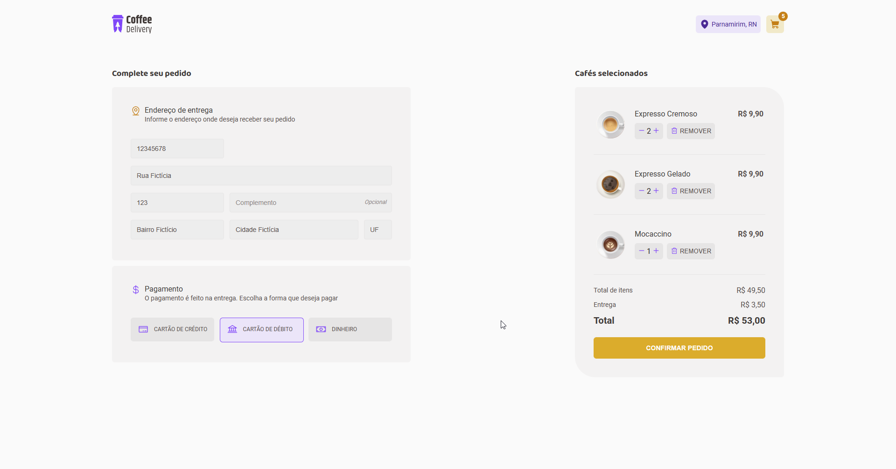
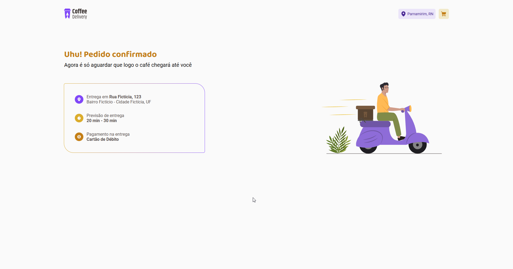

# Coffee Delivery - Challenge 2 | Rocketseat :rocket:

Second challenge of the Rocketseat Ignite Course.

### :hammer_and_wrench: Tools:

- Vite
- React
- Typescript
- Styled Components

### :white_check_mark: What you can do:

- Add a coffee into cart
- Cart Page: 
  * Change the number of products
  * Remove coffee
  * Fill the form and checkout 

### :camera: Screenshots

:computer: For desktop

    
    
    

